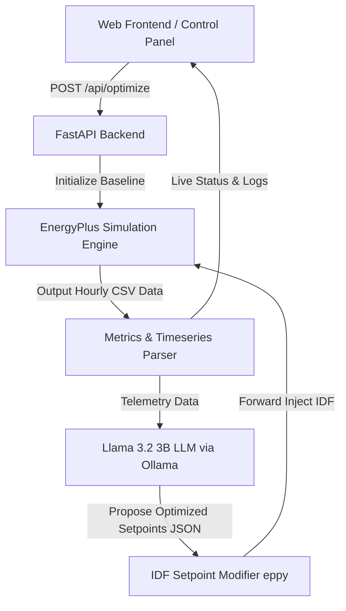

# Eco-Loop — Autonomous Building Energy & Thermal Comfort Optimization

**Demo video** - https://drive.google.com/file/d/1daqd_woi1IDkgeOfha9UF0vxyyFZxEj1/view?usp=sharing


**Eco-Loop** is a physical AI closed-loop control system that couples **EnergyPlus** (a physics-based building energy simulator) with **Llama 3.2 3B** (a local open-source LLM via Ollama) to autonomously optimize HVAC energy consumption while maintaining human thermal comfort standards.

---

## Key Functionalities

* **Autonomous Closed-Loop Optimization**: Evaluates building telemetry after each simulation run, Reasons over energy vs. comfort trade-offs, and forward-injects optimized HVAC setpoints into the EnergyPlus building model (`.idf`).
* **Physics-Based HVAC Simulation**: Integrates EnergyPlus for dynamic, hourly thermal and power load modeling of commercial office prototypes under seasonal Chicago weather profiles.
* **LLM Cognitive Reasoning Log**: Features an explainable AI decision feed powered by **Llama 3.2 3B**, detailing the engineering rationale behind every thermostat setpoint proposal.
* **Real-Time Telemetry & Terminal Console**: Displays live simulation status logs in a standard terminal logger and calculates real-time energy savings (% kWh), comfort violation reductions (hours), CO2 emission mitigations, and dollar cost savings.
* **Apple-Inspired Interface**: Clean, responsive light dashboard built with HTML5, Vanilla CSS, and Chart.js featuring multi-axis analytics for Temperature Trajectories, Occupant Comfort (PMV Index), and Hourly Power Load.

---

## Tech Stack

| Domain | Technologies & Libraries |
|:---|:---|
| **Physical Simulation** | EnergyPlus v24.1 / v26.1, `eppy` (IDF parser/modifier) |
| **Cognitive AI Engine** | Llama 3.2 3B, Ollama, OpenAI Python SDK |
| **Backend API Server** | Python 3.10+, FastAPI, Uvicorn, Pandas, NumPy |
| **Frontend Web Interface** | HTML5, Vanilla CSS, Vanilla JavaScript, Chart.js |
| **Version Control & Tooling** | Git, GitHub |

---

## System Architecture



---

## Project Structure

```
├── README.md
└── source code and building models/
    ├── server.py                  # FastAPI server handling API endpoints & background optimization loop
    ├── cognitive_engine.py        # LLM closed-loop optimization orchestrator
    ├── mcp_tools.py               # Building simulation tools & metric calculation
    ├── energyplus_wrapper.py      # EnergyPlus subprocess execution & CSV parser
    ├── idf_modifier.py            # IDF setpoint & occupancy modifier using eppy
    ├── system_architecture.md     # Detailed architecture & latency mitigation report
    ├── requirements.txt           # Python dependency requirements
    ├── .gitignore                 # Excludes simulation output CSVs and temp files
    ├── models/
    │   ├── baseline.idf           # DOE Commercial Reference Building (Small Office) model
    │   └── weather.epw            # Chicago O'Hare hourly weather profile
    └── static/
        ├── index.html             # Dashboard structure & inline SVGs
        ├── styles.css             # Apple Light design system & component styles
        └── app.js                 # API polling, Chart.js rendering, and DOM handlers
```

---

## Prerequisites & Installation

### 1. External Dependencies

1. **EnergyPlus**: Download and install **[EnergyPlus](https://energyplus.net/)** (v24.1.0 or v26.1.0). Ensure `energyplus` is in your system `PATH`.
2. **Ollama & Llama 3.2 3B**: Download and install **[Ollama](https://ollama.com/)**. Pull the `llama3.2:3b` model:
   ```bash
   ollama pull llama3.2:3b
   ```

### 2. Python Dependencies

Clone this repository and install Python packages:
```bash
git clone https://github.com/yashsushil16/Eco-Loop-Building-Agents.git
cd "Eco-Loop-Building-Agents/source code and building models"
pip install -r requirements.txt
```

---

## Running the Application

1. **Start the FastAPI Backend Server**:
   ```bash
   cd "source code and building models"
   python server.py
   ```
2. **Access the Web Dashboard**:
   Open your browser and navigate to:
   ```
   http://localhost:8000
   ```
3. **Run Optimization**:
   * Select your target season (**Winter** or **Summer**).
   * Set the desired number of optimization iterations (1–5).
   * Click **Initialize Optimization Loop** to start the closed-loop optimization engine.

---

## License & Acknowledgments

Developed for the Honeywell Hackathon. Powered by EnergyPlus, Ollama, and FastAPI.
