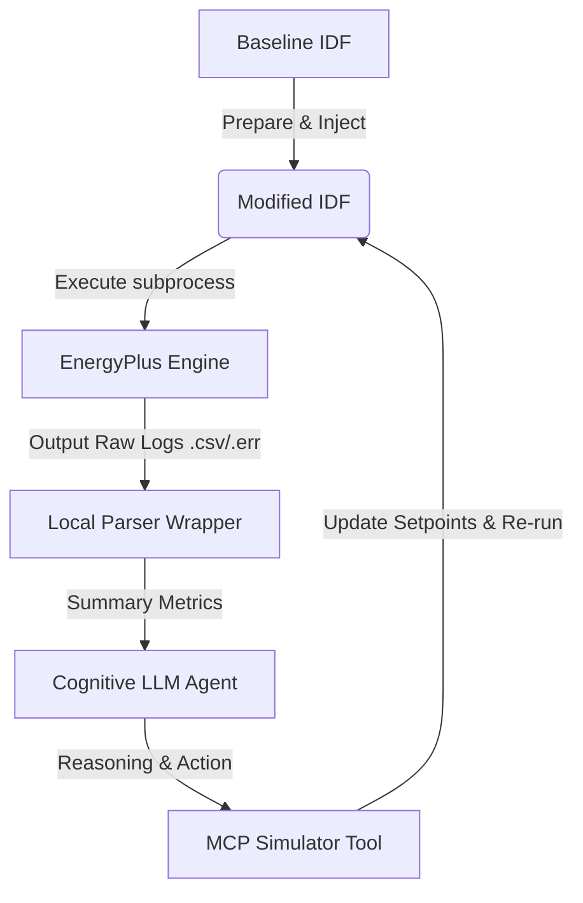

# Eco-Loop Building Agent: System Architecture Document

This document explains the technical architecture, prompt engineering strategies, latency management, and log-handling methods implemented in the Eco-Loop Building Agent Proof-of-Concept (PoC).

---

## 1. System Architecture Overview

The Eco-Loop Building Agent implements an autonomous closed-loop control system. It utilizes **EnergyPlus (v26.1.0)** as the physical building sandbox and a local **Llama 3.2 3B** LLM (via **Ollama**) as the cognitive brain.

The system is structured as follows:
1. **`idf_modifier.py`**: A programmatic interface using `eppy` to safely delete and reconstruct heating/cooling schedule objects, preventing EnergyPlus parsing errors.
2. **`energyplus_wrapper.py`**: A subprocess launcher that runs the simulation with weather files and compiles outputs using `ReadVarsESO`.
3. **`mcp_tools.py`**: Implements custom agentic tools for simulating, reading metrics, updating configurations, and parsing error logs.
4. **`cognitive_engine.py`**: Manages the agent loop, prompt construction, local OpenAI client connection, and cost evaluation.
5. **`dashboard.py`**: An interactive Streamlit visualizer displaying baseline vs. AI comparisons.

---

## 2. Tool-Calling & Agentic Architecture

The cognitive agent interacts with the simulation through a set of structured tools, representing a local **Model Context Protocol (MCP)** implementation:

*   **`run_simulation`**:
    *   **Parameters**: `cool_occ`, `cool_unocc`, `heat_occ`, `heat_unocc`, `occ_start`, `occ_end`.
    *   **Behavior**: Rebuilds schedules, runs EnergyPlus, calls the result parser, records the run metadata, and clears temporary workspace outputs.
*   **Self-Correction Feedback Loop**:
    *   If EnergyPlus reports a `Fatal Error` or compilation error (via `eplusout.err`), the wrapper catches it, extracts the raw warning lines, and reports them directly back to the LLM agent.
    *   The LLM parses the syntax warnings, corrects the parameter bounds, and submits a corrected run.

---

## 3. Prompt Engineering Strategies

To achieve stable optimization on a lightweight local model (`llama3.2:3b`), the prompting strategy uses **Structured Context Ingestion** and **Goal Constraints**:

1.  **System Persona**: Sets the role as an expert Building Energy Management System (EMS) AI.
2.  **Environmental Context**: Streams the current outdoor temperature range, letting the AI understand weather severity (e.g. Chicago sub-zero winter vs. hot summer).
3.  **Historical Trial Feeding**: The prompt injects a history of all previous trial parameters and their results. This lets the LLM perform reinforcement-like behavior, reasoning about how past adjustments changed energy and comfort (e.g., *"Trial 2 saved energy but increased violations, I must raise heating occupied slightly"*).
4.  **Physical Boundary Rules**: Explicit numerical bounds are provided in the prompt to prevent the model from outputting physically impossible values (e.g., heating setpoint of 45°C or cooling unoccupied less than occupied).
5.  **Output Structuring**: The LLM is instructed to write a short reasoning block followed by a clean JSON object. This is parsed reliably using regular expressions.

---

## 4. Prompt Latency Management

Running LLM inferences locally requires strict latency controls to ensure real-time responsiveness:
*   **Model Selection**: We deploy `llama3.2:3b` which is highly responsive on local consumer hardware (typical response time of 1-3 seconds).
*   **Low Temperature**: Temperature is set to `0.2` to enforce deterministic, focused answers and minimize token length.
*   **Concise Contexts**: Historical logs are truncated to only the last 3 runs. This keeps the prompt context window small (<1,500 tokens), preventing local CPU/GPU slowdown.

---

## 5. Technical Approach to Simulation Log Handling

EnergyPlus simulations produce high-frequency, massive outputs. An annual run generates:
*   `eplusout.csv` (10MB - 100MB of hourly timeseries data).
*   `eplusout.eso` (7MB - 80MB of raw output variables).
*   `eplusout.sql` (8MB - 90MB database files).

Feeding this raw data directly to an LLM is impossible due to context limits, and would cause massive prompt latency. 

### **Our Solution: Local Aggregation & Metrics Compression**
Instead of feeding raw files, the Python wrapper (`energyplus_wrapper.py`) performs local edge processing:
1.  **File Filtering**: It reads `eplusout.csv` using pandas and filters out the design days, isolating only the active weather run period (e.g., Jan 1-7 or July 1-7).
2.  **Metrics Compression**: It computes cumulative totals and means:
    $$\text{Electricity (kWh)} = \frac{\sum E_{\text{hourly}} (J)}{3.6 \times 10^6}$$
    $$\text{Gas (kWh)} = \frac{\sum G_{\text{hourly}} (J)}{3.6 \times 10^6}$$
3.  **Comfort Violations Tracking**: It loops over the occupied hours (08:00 - 18:00) and counts how many times the Predicted Mean Vote (PMV) in occupied zones deviates outside the comfort window of $[-0.5, 0.5]$.
4.  **Context Reduction**: This compresses the raw timeseries logs by **99.99%**, reducing MBs of data to a lightweight 10-line JSON dictionary representing key performance indices (KPIs). The LLM only receives these high-level KPIs, keeping the reasoning loop extremely fast and robust.
